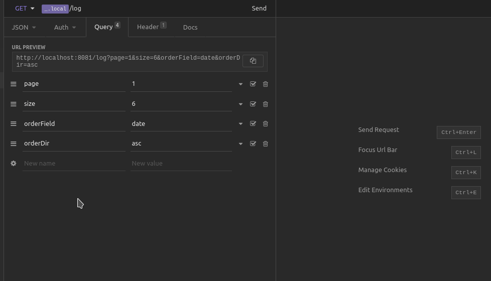

## Objetivo

Em projetos modernos é cada vez mais comum o uso de arquiteturas baseadas em serviços ou microsserviços. Nestes ambientes complexos, erros podem surgir em diferentes camadas da aplicação (backend, frontend, mobile, desktop) e mesmo em serviços distintos. Desta forma, é muito importante que os desenvolvedores possam centralizar todos os registros de erros em um local, de onde podem monitorar e tomar decisões mais acertadas. Neste projeto vamos implementar uma API Rest para centralizar registros de erros de aplicações.
Abaixo estão os requisitos desta API, o time terá total liberdade para tomar as decisões técnicas e de arquitetura da API, desde que atendam os requisitos abaixo.

## API

### Tecnologia
- Utilizar a tecnologia base da aceleração para o desenvolvimento (Exemplo: Java).

### Premissas
- A API deve ser pensada para atender diretamente um front-end;
- Deve ser capaz de gravar os logs de erro em um banco de dados relacional;
- O acesso a ela deve ser permitido apenas por requisições que utilizem um token de acesso válido.

### Funcionalidades
- Deve permitir a autenticação do sistema que deseja utilizar a API gerando o Token de Acesso;
- Pode ser acessado por multiplos sistemas;
- Deve permitir gravar registros de eventos de log salvando informações de Level (error, warning, info), Descrição do Evento, - LOG do Evento, ORIGEM (Sistema ou Serviço que originou o evento), DATA (Data do evento), QUANTIDADE (Quantidade de Eventos de mesmo tipo);
- Deve permitir a listagem dos eventos juntamente com a filtragem de eventos por qualquer parâmetro especificado acima;
- Deve suportar Paginação;
- Deve suportar Ordenação por diferentes tipos de atributos;
- A consulta de listagem não deve retornar os LOGs dos Eventos;
- Deve permitir a busca de um evento por um ID, dessa maneira exibindo o LOG desse evento em específico.

## Ideação

Essa aplicação backend, em Java, foi pensada de modo que os endpoints criados possam ser acessados por uma aplicação frontend, que exibirá todos os LOGs de erros persistidos em um banco de dados SQL. A aplicação contará com autenticação através de token, reforçando as premissas de segurança, e os dados exibidos ao usuário serão filtrados através da camada DTO da aplicação.

## Preparando ambiente

```javascript
sudo apt install maven
git clone git@github.com:ANDREHORMAN1994/PROJETO-LOG-MANAGER.git
cd PROJETO-LOG-MANAGER
mvn clean install
mvn spring-boot:run
```

## Recursos

- [Lombok](https://projectlombok.org/)
- [PostgresSQL](https://www.postgresql.org/)
- [Spring Data JPA](https://spring.io/projects/spring-data-jpa)
- [Spring Security](https://spring.io/projects/spring-security)
- [Spring Web Starter](https://spring.io/guides/gs/serving-web-content/)
- [Swagger](https://swagger.io/)
- [Oauth2](https://oauth.net/2/)


## Simulação

#### Get all logs


#### Get all logs by fields


#### Get all logs sort by date


#### Get all logs sort by description


#### Get all logs sort by id


#### Get by id


#### Get by page


#### Get by level


#### Get by origin


#### Post logs


